# 小邵教你玩转Typescript、ts版React全家桶脚手架
#### 地址：https://juejin.im/post/5c04d3f3f265da612e28649c

前言：大家好，我叫邵威儒，大家都喜欢喊我小邵，学的金融专业却凭借兴趣爱好入了程序猿的坑，从大学买的第一本vb和自学vb，我就与编程结下不解之缘，随后自学易语言写游戏辅助、交易软件，至今进入了前端领域，看到不少朋友都写文章分享，自己也弄一个玩玩，以下文章纯属个人理解，便于记录学习，肯定有理解错误或理解不到位的地方，意在站在前辈的肩膀，分享个人对技术的通俗理解，共同成长！

> 后续我会陆陆续续更新javascript方面，尽量把javascript这个学习路径体系都写一下  
> 包括前端所常用的es6、angular、react、vue、nodejs、koa、express、公众号等等  
> 都会从浅到深，从入门开始逐步写，希望能让大家有所收获，也希望大家关注我~

> 文章列表：https://juejin.im/user/5a84f871f265da4e82634f2d/posts  

> Author: 邵威儒  
> Email: 166661688@qq.com  
> Wechat: 166661688  
> github: https://github.com/iamswr/

***

在本文我将和大家一起玩转Typescript，目前angular、deno已经开始使用typescript，并且我们熟知的vue，在3.0也即将会使用typescript，可以说，前端领域，typescript会逐渐变为必备的技能，那么，为什么typescript变得越来越火呢？

网上有各种typescript和javascript的对比，那么在我的角度的理解，javascript是解释型（动态）语言，可以说是从上到下执行，在我们开发过程中，比如有语法错误等等，需要执行到这一行代码才能知道，而typescript则像写易语言那样生成exe时，需要静态编译，而静态编译这个过程，会把代码都检查一遍，看是否通过检测，最终才生成exe，typescript最终是也是编译成javascript原生代码的，只是在这个生成过程中，会进行各种检测，来检查代码是否符合语法啊规则啊，符合的话最终再编译成javascript，规范了我们代码的编写，同时也提高了代码的复用以及组件化，在runtime阶段为我们提前找到错误。

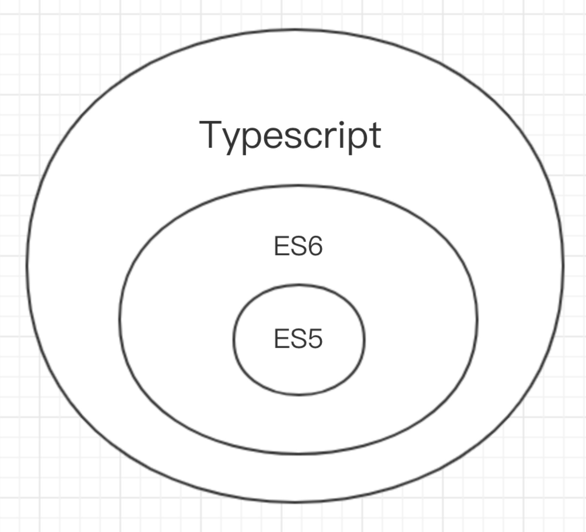

typescript支持es5/es6的语法，并且扩展了javascript语法，更像java、c#、swift这种语言了。

在前端nodejs很火，但是为什么在后端却不火，很大程度也是因为nodejs也是解释型（动态）语言，优势就是解释型语言比较灵活，但是缺点也很明显，用node开发后台程序，开发一直爽，重构火葬场=。=！一旦重构了，就会出现很多问题，像Java、c#这类语言，非常严谨，类型检查等非常严谨，而javascript呢，一般是靠我们用肉眼去排查，很麻烦，typescript就是解决这一类问题的。

总而言之，typescript是未来的趋势，也是谷歌推荐的框架，我也是刚学typescript，很多都是站在前辈的肩膀总结的，废话不多说，我们开始进入正题吧！

***

## 一.typescript 安装

首先我们全局安装

`npm i typescript -g`

全局安装完成后，我们新建一个`hello.ts`的ts文件
```
// hello.ts内容
let a = "邵威儒"
```
接下来我们在命令行输入`tsc hello.ts`来编译这个ts文件，然后会在同级目录生成一个编译好了的`hello.js`文件
```
// hello.js内容
var = "邵威儒"
```
那么我们每次都要输`tsc hello.ts`命令来编译，这样很麻烦，能否让它自动编译？答案是可以的，我平时使用vscode来开发，需要配置一下vscode就可以。

首先我们在命令行执行`tsc --init`来生成配置文件，然后我们在目录下看到生成了一个`tsconfig.json`文件

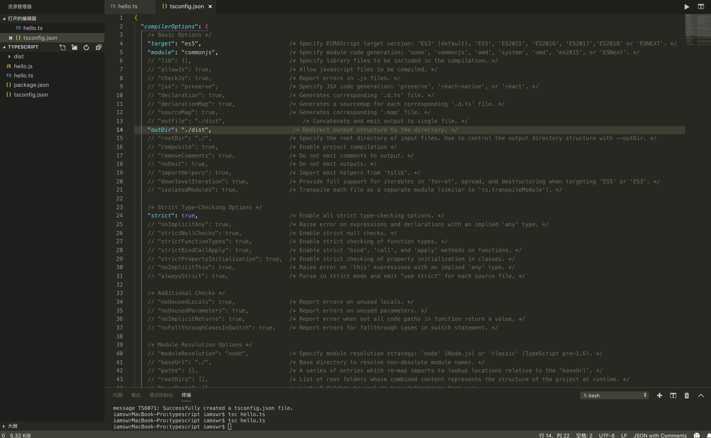

这个json文件里有很多选项
- `target`是选择编译到什么语法
- `module`则是模块类型
- `outDir`则是输出目录，可以指定这个参数到指定目录

接下来我们需要开启监控了，在vscode任务栏中

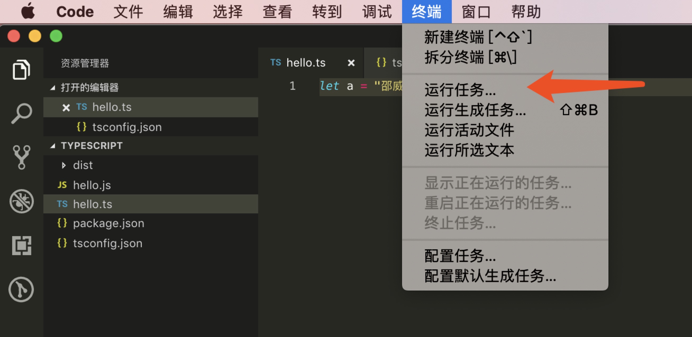


此时就会开启监控了，会监听ts的变化，然后自动去编译。

***

## 二、数据类型

java、c#是强类型语言，而js是弱类型语言，强弱类语言有什么区别呢？typescript最大的优点就是类型检查，可以帮你检查你定义的类型和赋值的类型。

#### 布尔类型boolean

```
// 在js中，定义isFlag为true，为布尔类型boolean
let isFlag = true;
// 但是我们也可以重新给它赋值为字符串
isFlag = "hello swr";

// 在ts中，定义isFlag为true，为布尔类型boolean
// 在变量名后加冒号和类型，如  :boolean
let isFlag:boolean = true
// 重新赋值到字符串类型会报错
isFlag = "hello swr" 

// 在java中，一般是这样定义，要写变量名也要写类型名
// int a = 10; 
// string name = "邵威儒"
```

#### 数字类型number
```
let age:number = 28;
age = 29;
```

#### 字符串类型string
```
let name:string = "邵威儒"
name = "iamswr"
```

以上`boolean、number、string`类型有个共性，就是可以通过`typeof`来获取到是什么类型，是基本数据类型。

那么复杂的数据类型是怎么处理的呢？

#### 数组 Array

```
// 在js中
let pets = ["旺财","小黑"];

// 在ts中
// 需要注意的是，这个是一个字符串类型的数组
// 只能往里面写字符串，写别的类型会报错
let pets:string[] = ["旺财","小黑"];

// 另外一种ts写法
let pets:Array<string> = ["旺财","小黑"];

// 那么如果想在数组里放对象呢？
let pets:Array<object> = [{name:"旺财"},{name:"小黑"}];

// 那么怎样在一个数组中，随意放string、number、boolean类型呢？
// 这里的 | 相当于 或 的意思
let arr:Array<string|number|boolean> = ["hello swr",28];

// 想在数组中放任意类型
let arr:Array<any> = ["hello swr",28,true]
```

#### 元组类型tuple

什么是元组类型？其实元组是数组的一种。

```
let person:[string,number] = ['邵威儒',28]
```
有点类似解构赋值，但是又不完全是解构赋值，比如元组类型必须一一对应上，多了少了或者类型不对都会报错。

元组类型是一个不可变的数组，长度、类型是不可变的。

#### 枚举类型enum

枚举在java中是从6.0才引入的一种类型，在java和ts中的关键字都是`enum`。

什么是枚举？枚举有点类似一一列举，一个一个数出来，在易语言中，我们会经常枚举窗口，来找到自己想要的，一般用于值是某几个固定的值，比如生肖（有12种）、星座（有12种）、性别（男女）等，这些值是固定的，可以一个一个数出来。

为什么我们要用枚举呢？我们可以定义一些值，定义完了后可以直接拿来用了，用的时候也不会赋错值。

比如我们普通赋值
```
// 我们给性别赋值一个boy，但是我们有时候手误，可能输成boy1、boy2了
// 这样就会导致我们赋值错误了
let sex = "boy"
```
既然这样容易导致手误赋错值，那么我们可以定义一个枚举
```
// 定义一个枚举类型的值
enum sex {
  BOY,
  GIRL
}
console.log(sex)
console.log(`邵威儒是${sex.BOY}`)
```
我们看看转为es5语法是怎样的
```
// 转为es5语法
"use strict";
var sex;
(function (sex) {
    sex[sex["BOY"] = 0] = "BOY";
    sex[sex["GIRL"] = 1] = "GIRL";
})(sex || (sex = {}));
console.log(sex); // 打印输出{ '0': 'BOY', '1': 'GIRL', BOY: 0, GIRL: 1 }
console.log("\u90B5\u5A01\u5112\u662F" + sex.BOY); // 打印输出 邵威儒是0
```
是不是感觉有点像给对象添加各种属性，然后这个属性又有点像常量，然后通过对象去取这个属性？  
上面这样写，不是很友好，那么我们还可以给`BOY` `GIRL`赋值
```
enum sex{
    BOY="男",
    GIRL="女"
}
```
```
// 转化为es5语法
// 我们顺便看看实现的原理
"use strict";
var sex;
// 首先这里是一个自执行函数
// 并且把sex定义为对象，传参进给自执行函数
// 然后给sex对象添加属性并且赋值
(function (sex) {
    sex["BOY"] = "\u7537";
    sex["GIRL"] = "\u5973";
})(sex || (sex = {}));
console.log(sex); // 打印输出 { BOY: '男', GIRL: '女' }
console.log("\u90B5\u5A01\u5112\u662F" + sex.BOY); // 打印输出 邵威儒是男
```
比如我们实际项目中，特别是商城类，订单会存在很多状态流转，那么非常适合用枚举
```
enum orderStatus {
    WAIT_FOR_PAY = "待支付",
    UNDELIVERED = "完成支付，待发货",
    DELIVERED = "已发货",
    COMPLETED = "已确认收货"
}
```
到这里，我们会有一个疑虑，为什么我们不这样写呢？
```
let orderStatus2 = {
    WAIT_FOR_PAY : "待支付",
    ...
}
```
如果我们直接写对象的键值对方式，是可以在外部修改这个值的，而我们通过`enum`则不能修改定义好的值了，更加严谨。

#### 任意类型 any

`any`有好处也有坏处，特别是前端，很多时候写类型的时候，几乎分不清楚类型，任意去写，写起来很爽，但是对于后续的重构、迭代等是非常不友好的，会暴露出很多问题，某种程度来说，any类型就是放弃了类型检查了。。。

比如我们有这样一个场景，就是需要获取某一个dom节点
```
let btn = document.getElementById('btn');
btn.style.color = "blue";
```
此时我们发现在ts中会报错


因为我们取这个dom节点，有可能取到，也有可能没取到，当没取到的时候，相当于是null，是没有style这个属性的。

那么我们可以给它添加一个类型为`any`

```
// 添加一个any类型，此时就不会报错了，但是也相当于放弃了类型检查了
let btn:any = document.getElementById('btn');
btn.style.color = "blue";

// 当然也有粗暴一些的方式，利用 ! 强制断言
let btn = document.getElementById("btn");
btn!.style!.color = "blue";

// 可以赋值任何类型的值
// 跟以前我们var let声明的一模一样的
let person:any = "邵威儒"
person = 28
```

#### null undefined类型

这个也没什么好说的，不过可以看下下面的例子
```
// (string | number | null | undefined) 相当于这几种类型
// 是 string 或 number 或 null 或 undefined
let str:(string | number | null | undefined)
str = "hello swr"
str = 28
str = null
str = undefined
```

#### void类型

void表示没有任何类型，一般是定义函数没有返回值。

```
// ts写法
function say(name:string):void {
  console.log("hello",name)
}
say("swr")
```
```
// 转为es5
"use strict";
function say(name) {
    console.log("hello", name);
}
say("swr");
```
怎么理解叫没有返回值呢？此时我们给函数return一个值
```
function say(name:string):void {
  console.log("hello",name)
  // return "ok" 会报错
  return "ok"
  // return undefined 不会报错
  // return 不会报错
}
say("swr")
```
那么此时我们希望这个函数返回一个字符串类型怎么办？
```
function say(name:string):string {
  console.log("hello",name)
  return "ok"
}
say("swr")
```

#### never类型

这个用得很少，一般是用于抛出异常。
```
let xx:never;
function error(message: string): never {
  throw new Error(message);
}

error("error")
```

#### 我们要搞明白any、never、void

- any是任意的值
- void是不能有任何值
- never永远不会有返回值

`any`比较好理解，就是任何值都可以
```
let str:any = "hello swr"
str = 28
str = true
```

`void`不能有任何值(返回值)
```
function say():void {
  
}
```

`never`则不好理解，什么叫永远不会有返回值？

```
// 除了上面举例的抛出异常以外，我们看一下这个例子
// 这个loop函数，一旦开始执行，就永远不会结束
// 可以看出在while中，是死循环，永远都不会有返回值，包括undefined

function loop():never {
    while(true){
        console.log("陷入死循环啦")
    }
}

loop()

// 包括比如JSON.parse也是使用这种 never | any
function parse(str:string):(never | any){
    return JSON.parse(str)
}
// 首先在正常情况下，我们传一个JSON格式的字符串，是可以正常得到一个JSON对象的
let json = parse('{"name":"邵威儒"}')
// 但是有时候，传进去的不一定是JSON格式的字符串，那么就会抛出异常
// 此时就需要never了
let json = parse("iamswr")
```

也就是说，当一个函数执行的时候，被抛出异常打断了，导致没有返回值或者该函数是一个死循环，永远没有返回值，这样叫做永远不会有返回值。

实际开发中，是never和联合类型来一起用，比如
```
function say():(never | string) {
  return "ok"
}
```

***

## 三.函数

函数是这样定义的
```
function say(name:string):void {
  console.log("hello",name)
}
say("邵威儒")
```
形参和实参要完全一样，如想不一样，则需要配置可选参数，可选参数放在后面
```
// 形参和实参一一对应，完全一样
function say(name:string,age:number):void {
  console.log("hello",name,age)
}
say("邵威儒",28)
```

```
// 可选参数，用 ？ 处理，只能放在后面
function say(name:string,age?:number):void {
  console.log("hello",name,age)
}
say("邵威儒")
```
那么如何设置默认参数呢？
```
// 在js中我们是这样写的
function ajax(url,method="get"){
    console.log(url,method)
}

// 在ts中我们是这样写的
function ajax(url:string,method:string = "GET") {
  console.log(url,method)
}
```
那么如何设置剩余参数呢？可以利用扩展运算符
```
function sum(...args:Array<number>):number {
  return eval(args.join("+"))
}
let total:number = sum(1,2,3,4,5)
console.log(total)
```
那么如何实现函数重载呢？函数重载是java中非常有名的，在java中函数的重载，是指两个或者两个以上的同名函数，参数的个数和类型不一样
```
// 比如说我们现在有2个同名函数
function say(name:string){
    
}
function say(name:string,age:number){
    
}
// 那么我想达到一个效果
// 当我传参数name时，执行name:string这个函数
// 当我传参数name和age时，执行name:string,age:number这个函数
// 此时该怎么办？
```
接下来看一下typescript中的函数重载
```
// 首先声明两个函数名一样的函数
function say(val: string): void; // 函数的声明
function say(val: number): void; // 函数的声明
// 函数的实现，注意是在这里是有函数体的
// 其实下面的say()无论怎么执行，实际上就是执行下面的函数
function say(val: any):void {
  console.log(val)
}

say("hello swr")
say(28)
```
在typescript中主要体现是同一个同名函数提供多个函数类型定义，函数实际上就只有一个，就是拥有函数体那个，如果想根据传入值类型的不一样执行不同逻辑，则需要在这个函数里面进行一个类型判断。

那么这个函数重载有什么作用呢？其实在ts中，函数重载只是用来限制参数的个数和类型，用来检查类型的，而且重载不能拆开几个函数，这一点和java的处理是不一样的，需要注意。

***

## 四、类

#### 如何定义一个类？
```
// ts写法
// 其实跟es6非常像，没太大的区别
class Person{
  // 这里声明的变量，是实例上的属性
  name:string
  age:number
  constructor(name:string,age:number){
    // this.name和this.age必须在前面先声明好类型
    // name:string   age:number
    this.name = name
    this.age = age
  }
  // 原型方法
  say():string{
    return "hello swr"
  }
}

let p = new Person("邵威儒",28)
```
```
// 那么转为es5呢？
"use strict";
var Person = /** @class */ (function () {
    function Person(name, age) {
        this.name = name;
        this.age = age;
    }
    Person.prototype.say = function () {
        return "hello swr";
    };
    return Person;
}());
var p = new Person("邵威儒", 28);
```
#### 可以发现，其实跟我们es6的class是非常像的，那么类的继承是怎样实现呢？
```
// 类的继承和es6也是差不多
class Parent{
  // 这里声明的变量，是实例上的属性
  name:string
  age:number
  constructor(name:string,age:number){
    // this.name和this.age必须在前面先声明好类型
    // name:string   age:number
    this.name = name
    this.age = age
  }
  // 原型方法
  say():string{
    return "hello swr"
  }
}

class Child extends Parent{
  childName:string
  constructor(name:string,age:number,childName:string){
    super(name,age)
    this.childName = childName
  }
  childSay():string{
    return this.childName
  }
}

let child = new Child("邵威儒",28,"bb")
console.log(child)
```
#### 类的修饰符
- `public`公开的，可以供自己、子类以及其它类访问
- `protected`受保护的，可以供自己、子类访问，但是其他就访问不了
- `private`私有的，只有自己访问，而子类、其他都访问不了

```
class Parent{
  public name:string
  protected age:number
  private money:number

  /**
   * 也可以简写为
   * constructor(public name:string,protected age:number,private money:number)
   */

  constructor(name:string,age:number,money:number){
    this.name = name
    this.age = age
    this.money = money
  }
  getName():string{
    return this.name
  }
  getAge():number{
    return this.age
  }
  getMoney():number{
    return this.money
  }
}

let p = new Parent("邵威儒",28,10)
console.log(p.name)
console.log(p.age) // 报错
console.log(p.money) // 报错
```
#### 静态属性、静态方法，跟es6差不多
```
class Person{
    // 这是类的静态属性
    static name = "邵威儒"
    // 这是类的静态方法，需要通过这个类去调用
    static say(){
        console.log("hello swr")
    }
}
let p = new Person()
Person.say() // hello swr
p.say() // 报错
```
#### 抽象类

抽象类和方法，有点类似抽取共性出来，但是又不是具体化，比如说，世界上的动物都需要吃东西，那么会把吃东西这个行为，抽象出来。

如果子类继承的是一个抽象类，子类必须实现父类里的抽象方法，不然的话不能实例化，会报错。

```
// 关键字 abstract 抽象的意思
// 首先定义个抽象类Animal
// Animal类有一个抽象方法eat
abstract class Animal{
    // 实际上是使用了public修饰符
    // 如果添加private修饰符则会报错
    abstract eat():void;
}

// 需要注意的是，这个Animal类是不能实例化的
let animal = new Animal() // 报错

// 抽象类的抽象方法，意思就是，需要在继承这个抽象类的子类中
// 实现这个抽象方法，不然会报错
// 报错，因为在子类中没有实现eat抽象方法
class Person extends Animal{
    eat1(){
        console.log("吃米饭")
    }
}

// Dog类继承Animal类后并且实现了抽象方法eat，所以不会报错
class Dog extends Animal{
    eat(){
        console.log("吃骨头")
    }
}
```

***

## 五、接口

这里的接口，主要是一种规范，规范某些类必须遵守规范，和抽象类有点类似，但是不局限于类，还有属性、函数等。

#### 首先我们看看接口是如何规范对象的

```
// 假设我需要获取用户信息
// 我们通过这样的方式，规范必须传name和age的值
function getUserInfo(user:{name:string,age:number}){
    console.log(`${user.name} ${user.age}`)
}
getUserInfo({name:"邵威儒",age:28})
```
这样看，还是挺完美的，那么问题就出现了，如果我另外还有一个方法，也是需要这个规范呢？
```
function getUserInfo(user:{name:string,age:number}){
    console.log(`${user.name} ${user.age}`)
}
function getInfo(user:{name:string,age:number}){
    console.log(`${user.name} ${user.age}`)
}
getUserInfo({name:"邵威儒",age:28})
getInfo({name:"iamswr",age:28})
```
可以看出，函数`getUserInfo`和`getInfo`都遵循同一个规范，那么我们有办法对这个规范复用吗？
```
// 首先把需要复用的规范，写到接口中 关键字 interface
interface infoInterface{
    name:string,
    age:number
}
// 然后把这个接口，替换到我们需要复用的地方
function getUserInfo(user:infoInterface){
    console.log(`${user.name} ${user.age}`)
}
function getInfo(user:infoInterface){
    console.log(`${user.name} ${user.age}`)
}
getUserInfo({name:"邵威儒",age:28})
getInfo({name:"iamswr",age:28})
```

那么有些参数可传可不传，该怎么处理呢？
```
interface infoInterface{
    name:string,
    age:number,
    city?:string // 该参数为可选参数
}
function getUserInfo(user:infoInterface){
    console.log(`${user.name} ${user.age} ${user.city}`)
}
function getInfo(user:infoInterface){
    console.log(`${user.name} ${user.age}`)
}
getUserInfo({name:"邵威儒",age:28,city:"深圳"})
getInfo({name:"iamswr",age:28})
```

#### 接口是如何规范函数的

```
// 对一个函数的参数和返回值进行规范
interface mytotal {
  // 左侧是函数的参数，右侧是函数的返回类型
  (a:number,b:number) : number
}

let total:mytotal = function (a:number,b:number):number {
  return a + b
}

console.log(total(10,20))
```
#### 接口是如何规范数组的

```
interface userInterface {
  // index为数组的索引，类型是number
  // 右边是数组里为字符串的数组成员
  [index: number]: string
}
let arr: userInterface = ['邵威儒', 'iamswr'];
console.log(arr);
```

#### 接口是如何规范类的

这个比较重要，因为写react的时候会经常使用到类

```
// 首先实现一个接口
interface Animal{
    // 这个类必须有name
    name:string,
    // 这个类必须有eat方法
    // 规定eat方法的参数类型以及返回值类型
    eat(any:string):void
}
// 关键字 implements 实现
// 因为接口是抽象的，需要通过子类去实现它
class Person implements Animal{
    name:string
    constructor(name:string){
        this.name = name
    }
    eat(any:string):void{
        console.log(`吃${any}`)
    }
}
```
那么如果想遵循多个接口呢？
```
interface Animal{
    name:string,
    eat(any:string):void
}
// 新增一个接口
interface Animal2{
    sleep():void
}
// 可以在implements后面通过逗号添加，和java是一样的
// 一个类只能继承一个父类，但是却能遵循多个接口
class Person implements Animal,Animal2{
    name:string
    constructor(name:string){
        this.name = name
    }
    eat(any:string):void{
        console.log(`吃${any}`)
    }
    sleep(){
        console.log('睡觉')
    }
}
```

#### 接口可以继承接口

```
interface Animal{
    name:string,
    eat(any:string):void
}
// 像类一样，通过extends继承
interface Animal2 extends Animal{
    sleep():void
}
// 因为Animal2类继承了Animal
// 所以这里遵循Animal2就相当于把Animal也继承了
class Person implements Animal2{
    name:string
    constructor(name:string){
        this.name = name
    }
    eat(any:string):void{
        console.log(`吃${any}`)
    }
    sleep(){
        console.log('睡觉')
    }
}
```

***

## 六、泛型

泛型可以支持不特定的数据类型，什么叫不特定呢？比如我们有一个方法，里面接收参数，但是参数类型我们是不知道，但是这个类型在方法里面很多地方会用到，参数和返回值要保持一致性

```
// 假设我们有一个需求，我们不知道函数接收什么类型的参数，也不知道返回值的类型
// 而我们又需要传进去的参数类型和返回值的类型保持一致，那么我们就需要用到泛型

// <T>的意思是泛型，即generic type
// 可以看出value的类型也为T，返回值的类型也为T
function deal<T>(value:T):T{
    return value
}
// 下面的<string>、<number>实际上用的时候再传给上面的<T>
console.log(deal<string>("邵威儒"))
console.log(deal<number>(28))
```
#### 实际上，泛型用得还是比较少，主要是看类的泛型是如何使用的

```
class MyMath<T>{
  // 定义一个私有属性
  private arr:T[] = []
  // 规定传参类型
  add(value:T){
    this.arr.push(value)
  }
  // 规定返回值的类型
  max():T{
    return Math.max.apply(null,this.arr)
  }
}

// 这里规定了类型为number
// 相当于把T都替换成number
let mymath = new MyMath<number>()
mymath.add(1)
mymath.add(2)
mymath.add(3)
console.log(mymath.max())

// 假设我们传个字符串呢？
// 则会报错:类型“"邵威儒"”的参数不能赋给类型“number”的参数。
mymath.add("邵威儒")
```

那么我们会思考，有了接口为什么还需要抽象类？  

接口里面只能放定义，抽象类里面可以放普通类、普通类的方法、定义抽象的东西。  

比如说，我们父类有10个方法，其中9个是实现过的方法，有1个是抽象的方法，那么子类继承过来，只需要实现这一个抽象的方法就可以了，但是接口的话，则是全是抽象的，子类都要实现这些方法，简而言之，接口里面不可以放实现，而抽象类可以放实现。

***

## 六、用Typescript版React全家桶脚手架，让你更清楚如何在项目中使用ts

这部分代码我传到了github地址 https://github.com/iamswr/ts_react_demo_20181207 ，大家可以结合来看

我们用ts来搭建一下ts版的react版全家桶脚手架，接下来这部分需要webpack和react的相关基础，<b>我尽量把注释写全，最好结合git代码一起看或者跟着敲一遍，这样更好理解</b>~  

首先，我们生成一个目录`ts_react_demo`，输入`npm init -y`初始化项目  

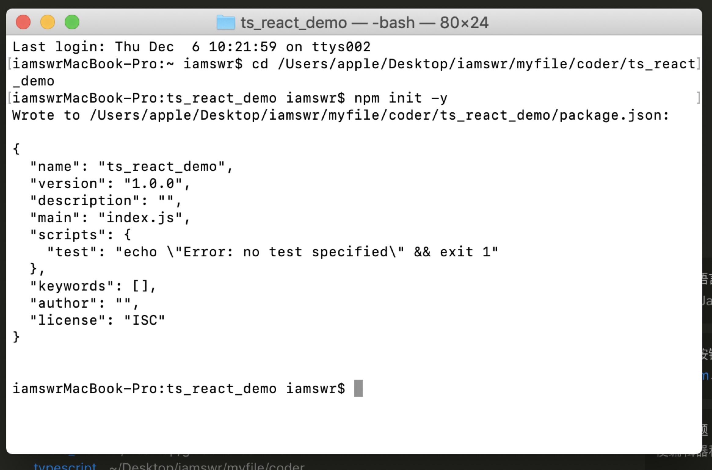

然后在项目里我们需要一个`.gitignore`来忽略指定目录不传到git上  

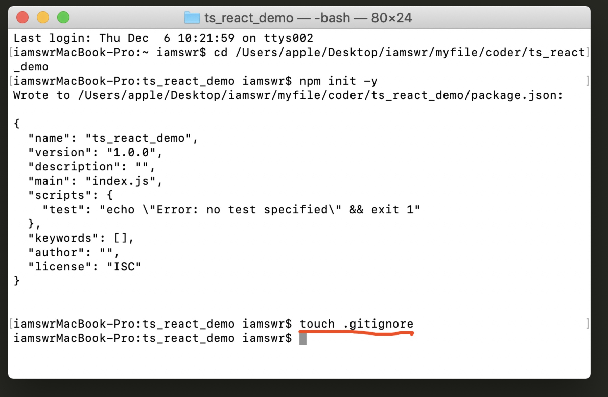

进入`.gitignore`输入我们需要忽略的目录，一般是`node_modules`
```
// .gitignore
node_modules
```

接下来我们准备下载相应的依赖包，这里需要了解一个概念，就是`类型定义文件`  

*------------------------插入开始-------------------------*

#### 类型定义文件

因为目前主流的第三方库都是以javascript编写的，如果用typescript开发，会导致在编译的时候会出现很多找不到类型的提示，那么如果让这些库也能在ts中使用呢？  

我们在ios开发的时候，会遇到swift、co混合开发，为了解决两种语法混合开发，是通过一个`.h`格式的桥接头来把两者联系起来,在js和ts，也存在这样的概念。  

`类型定义文件(*.d.ts)`就是能够让编辑器或者插件来检测到第三方库中js的静态类型，这个文件是以`.d.ts`结尾。  

比如说`react`的类型定义文件：https://github.com/DefinitelyTyped/DefinitelyTyped/tree/master/types/react  

在typescript2.0中，是使用@type来进行类型定义，当我们使用@type进行类型定义，typescript会默认查看`./node_modules/@types`文件夹，可以通过这样来安装这个库的定义库`npm install @types/react --save`

*------------------------插入结束-------------------------*

接下来，我们需要下载相关依赖包，涉及到以下几个包

*------------------------安装依赖包开始-------------------------*

> 这部分代码已传到 https://github.com/iamswr/ts_react_demo_20181207/tree/webpack_done 分支：webpack_done

#### react相关
```
- react // react的核心文件
- @types/react // 声明文件
- react-dom // react dom的操作包
- @types/react-dom 
- react-router-dom // react路由包
- @types/react-router-dom
- react-redux
- @types/react-redux
- redux-thunk  // 中间件
- @types/redux-logger
- redux-logger // 中间件
- connected-react-router
```
执行安装依赖包`npm i react react-dom @types/react @types/react-dom react-router-dom @types/react-router-dom react-redux @types/react-redux redux-thunk redux-logger @types/redux-logger connected-react-router -S`

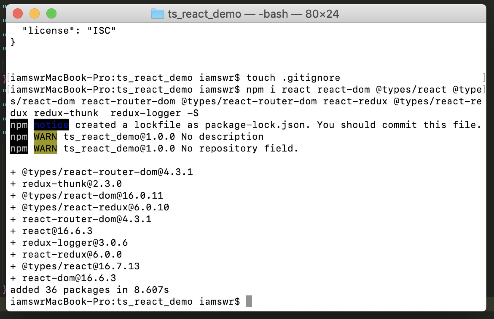

#### webpack相关
```
- webpack // webpack的核心包
- webpack-cli // webapck的工具包
- webpack-dev-server // webpack的开发服务
- html-webpack-plugin // webpack的插件，可以生成index.html文件
```
执行安装依赖包`npm i webpack webpack-cli webpack-dev-server html-webpack-plugin -D`，这里的`-D`相当于`--save-dev`的缩写，下载开发环境的依赖包


#### typescript相关
```
- typescript // ts的核心包
- ts-loader // 把ts编译成指定语法比如es5 es6等的工具，有了它，基本不需要babel了，因为它会把我们的代码编译成es5
- source-map-loader // 用于开发环境中调试ts代码
```
执行安装依赖包`npm i typescript ts-loader source-map-loader -D`

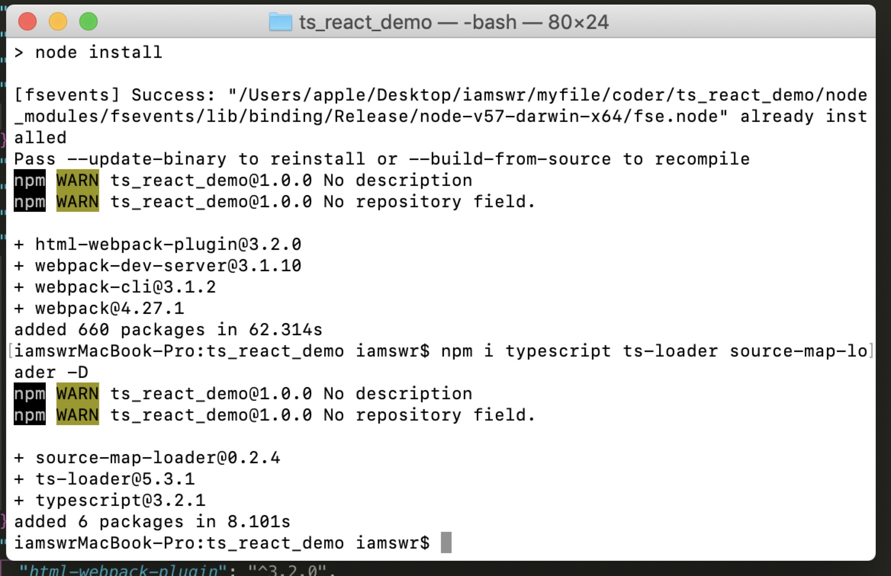

从上面可以看出，基本都是模块和声明文件都是一对对出现的，有一些不是一对对出现，就是因为都集成到一起去了。

声明文件可以在`node_modules/@types/xx/xx`中找到。

*------------------------安装依赖包结束-------------------------*

*---------------------Typescript config配置开始----------------------*

首先我们要生成一个`tsconfig.json`来告诉`ts-loader`怎样去编译这个ts代码  
```
tsc --init
```
会在项目中生成了一个`tsconfig.json`文件，接下来进入这个文件，来修改相关配置  
```
// tsconfig.json
{
  // 编译选项
  "compilerOptions": {
    "target": "es5", // 编译成es5语法
    "module": "commonjs", // 模块的类型
    "outDir": "./dist", // 编译后的文件目录
    "sourceMap": true, // 生成sourceMap方便我们在开发过程中调试
    "noImplicitAny": true, // 每个变量都要标明类型
    "jsx": "react", // jsx的版本,使用这个就不需要额外使用babel了，会编译成React.createElement
  },
  // 为了加快整个编译过程，我们指定相应的路径
  "include": [
    "./src/**/*"
  ]
}
```
*---------------------Typescript config配置结束----------------------*

*---------------------webpack配置开始----------------------*

#### 在`./src/`下创建一个`index.html`文件，并且添加`<div id='app'></div>`标签

```
// ./src/index.html
<!DOCTYPE html>
<html lang="en">
<head>
  <meta charset="UTF-8">
  <meta name="viewport" content="width=device-width, initial-scale=1.0">
  <meta http-equiv="X-UA-Compatible" content="ie=edge">
  <title>Document</title>
</head>
<body>
  <div id='app'></div>
</body>
</html>
```
#### 在`./`下创建一个webpack配置文件`webpack.config.js`

```
// ./webpack.config.js
// 引入webpack
const webpack = require("webpack");
// 引入webpack插件 生成index.html文件
const HtmlWebpackPlugin = require("html-webpack-plugin");
const path = require("path")

// 把模块导出
module.exports = {
  // 以前是jsx，因为我们用typescript写，所以这里后缀是tsx
  entry:"./src/index.tsx",
  // 指定模式为开发模式
  mode:"development",
  // 输出配置
  output:{
    // 输出目录为当前目录下的dist目录
    path:path.resolve(__dirname,'dist'),
    // 输出文件名
    filename:"index.js"
  },
  // 为了方便调试，还要配置一下调试工具
  devtool:"source-map",
  // 解析路径，查找模块的时候使用
  resolve:{
    // 一般写模块不会写后缀，在这里配置好相应的后缀，那么当我们不写后缀时，会按照这个后缀优先查找
    extensions:[".ts",'.tsx','.js','.json']
  },
  // 解析处理模块的转化
  module:{
    // 遵循的规则
    rules:[
      {
        // 如果这个模块是.ts或者.tsx，则会使用ts-loader把代码转成es5
        test:/\.tsx?$/,
        loader:"ts-loader"
      },
      {
        // 使用sourcemap调试
        // enforce:pre表示这个loader要在别的loader执行前执行
        enforce:"pre",
        test:/\.js$/,
        loader:"source-map-loader"
      }
    ]
  },
  // 插件的配置
  plugins:[
    // 这个插件是生成index.html
    new HtmlWebpackPlugin({
      // 以哪个文件为模板，模板路径
      template:"./src/index.html",
      // 编译后的文件名
      filename:"index.html"
    }),
    new webpack.HotModuleReplacementPlugin()
  ],
  // 开发环境服务配置
  devServer:{
    // 启动热更新,当模块、组件有变化，不会刷新整个页面，而是局部刷新
    // 需要和插件webpack.HotModuleReplacementPlugin配合使用
    hot:true, 
    // 静态资源目录
    contentBase:path.resolve(__dirname,'dist')
  }
}
```
#### 那么我们怎么运行这个`webpack.config.js`呢？这就需要我们在`package.json`配置一下脚本  

#### 在`package.json`里的`script`，添加`build`和`dev`的配置

```
{
  "name": "ts_react_demo",
  "version": "1.0.0",
  "description": "",
  "main": "index.js",
  "scripts": {
    "build": "webpack",
    "dev":"webpack-dev-server"
  },
  "keywords": [],
  "author": "",
  "license": "ISC",
  "dependencies": {
    "@types/react": "^16.7.13",
    "@types/react-dom": "^16.0.11",
    "@types/react-redux": "^6.0.10",
    "@types/react-router-dom": "^4.3.1",
    "connected-react-router": "^5.0.1",
    "react": "^16.6.3",
    "react-dom": "^16.6.3",
    "react-redux": "^6.0.0",
    "react-router-dom": "^4.3.1",
    "redux-logger": "^3.0.6",
    "redux-thunk": "^2.3.0"
  },
  "devDependencies": {
    "html-webpack-plugin": "^3.2.0",
    "source-map-loader": "^0.2.4",
    "ts-loader": "^5.3.1",
    "typescript": "^3.2.1",
    "webpack": "^4.27.1",
    "webpack-cli": "^3.1.2",
    "webpack-dev-server": "^3.1.10"
  }
}
```
#### 因为入口文件是`index.tsx`，那么我们在`./src/`下创建一个`index.tsx`，并且在里面写入一段代码，看看webpack是否能够正常编译

#### 因为我们在`webpack.config.js`中`entry`设置的入口文件是`index.tsx`，并且在`module`中的`rules`会识别到`.tsx`格式的文件，然后执行相应的`ts-loader`

```
// ./src/index.tsx
console.log("hello swr")
```

#### 接下来我们`npm run build`一下，看看能不能正常编译

```
npm run build
```

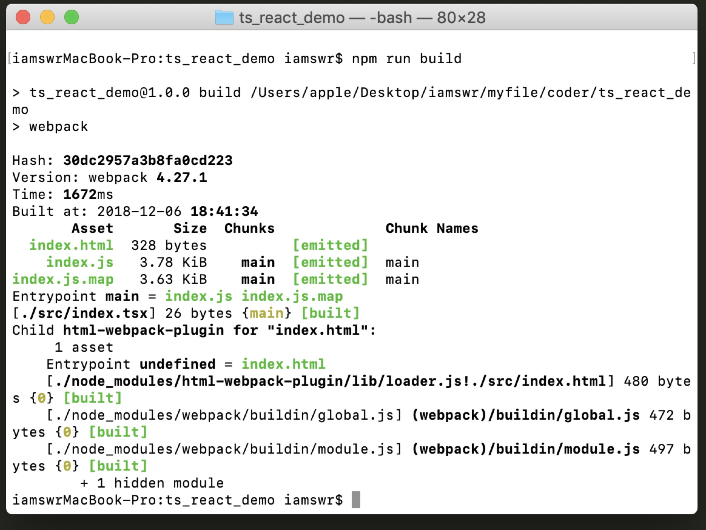

嗯，很好，编译成功了，我们可以看看`./dist/`下生成了`index.html` `index.js` `index.js.map`三个文件  

那么我们在开发过程中，不会每次都`npm run build`来看修改的结果，那么我们平时开发过程中可以使用`npm run dev`  

```
npm run dev
```

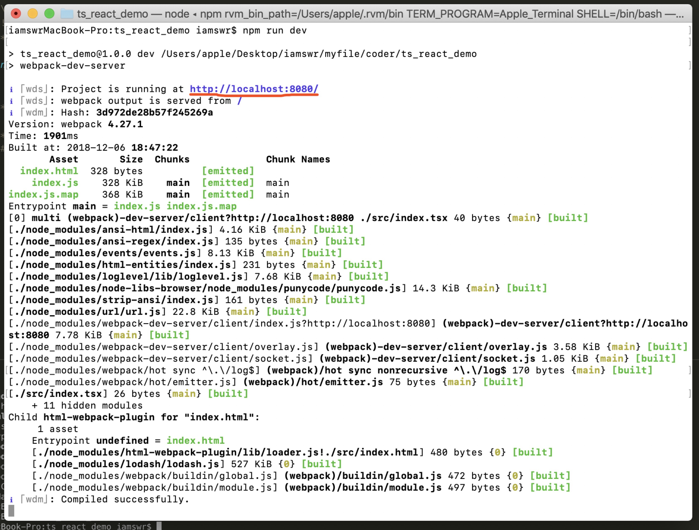

这样就启动成功了一个`http://localhost:8080/`的服务了。  

#### 那么我们如何配置我们的开发服务器呢？  

接下来我们修改`webpack.config.js`的配置，新增一个`devServer`配置对象，代码更新在上面`webpack.config.js`中，配置开发环境的服务以及热更新。

接下来我们看看热更新是否配置正常，在`./src/index.tsx`中新增一个`console.log('hello 邵威儒')`，我们发现浏览器的控制台会自动打印出这一个输出，说明配置正常了。

#### 为了更好查阅代码，到目前这一步的代码已传到 https://github.com/iamswr/ts_react_demo_20181207/tree/webpack_done 分支为"webpack_done""

*---------------------webpack配置结束----------------------*

*---------------------计数器组件开始----------------------*

> 这部分代码已传到 https://github.com/iamswr/ts_react_demo_20181207/tree/CounterComponent_1 分支：CounterComponent_1

接下来我们开始写react，我们按照官方文档（ https://redux.js.org/ ），写一个计数器来演示。  

首先我们在`./src/`下创建一个文件夹`components`，然后在`./src/components/`下创建文件`Counter.tsx`

```
// ./src/components/Counter.tsx
// import React from "react"; // 之前的写法
// 在ts中引入的写法
import * as React from "react";

export default class CounterComponent extends React.Component{
  // 状态state
  state = {
    number:0
  }
  render(){
    return(
      <div>
        <p>{this.state.number}</p>
        <button onClick={()=>this.setState({number:this.state.number + 1})}>+</button>
      </div>
    )
  }
}
```

我们发现，其实除了引入`import * as React from "react"`以外，其余的和之前的写法没什么不同。  

接下来我们到`./src/index.tsx`中把这个组件导进来  

```
// ./src/index.tsx
import * as React from "react";
import * as ReactDom from "react-dom";
import CounterComponent from "./components/Counter";
// 把我们的CounterComponent组件渲染到id为app的标签内
ReactDom.render(<CounterComponent />,document.getElementById("app"))
```

这样我们就把这个组件引进来了，接下来我们看下是否能够成功跑起来  


到目前为止，感觉用ts写react还是跟以前差不多，没什么区别，要记住，ts最大的特点就是类型检查，可以检验属性的状态类型。  

假设我们需要在`./src/index.tsx`中给`<CounterComponent />`传一个属性`name`，而`CounterComponent`组件需要对这个传入的`name`进行类型校验，比如说只允许传字符串。  

`./src/index.tsx`中修改一下
```
ReactDom.render(<CounterComponent name="邵威儒" />,document.getElementById("app"))
```

然后需要在`./src/components/Counter.tsx`中写一个接口来对这个`name`进行类型校验  

```
// ./src/components/Counter.tsx
// import React from "react"; // 之前的写法
// 在ts中引入的写法
import * as React from "react";
// 写一个接口对name进行类型校验
// 如果我们不写校验的话，在外部传name进来会报错的
interface IProps{
  name:string,
}
// 我们还可以用接口约束state的状态
interface IState{
  number: number
}
// 把接口约束的规则写在这里
// 如果传入的name不符合类型会报错
// 如果state的number属性不符合类型也会报错
export default class CounterComponent extends React.Component<IProps, IState>{
  // 状态state
  state = {
    number:0
  }
  render(){
    return(
      <div>
        <p>{this.state.number}</p>
        <p>{this.props}</p>
        <button onClick={()=>this.setState({number:this.state.number + 1})}>+</button>
      </div>
    )
  }
}
```

接下来看看如何在redux中使用ts呢？

*---------------------计数器组件结束----------------------*

*---------------------Redux开始----------------------*

> 这部分代码已传到 https://github.com/iamswr/ts_react_demo_20181207/tree/redux_thunk  
> 分支：redux_thunk

上面state中的number就不放在组件里了，我们放到redux中，接下来我们使用redux。  

首先在`./src/`创建`store`目录，然后在`./src/store/`创建一个文件`index.tsx`  

```
// .src/store/index.tsx
import { createStore } from "redux";
// 引入reducers
import reducers from "./reducers";
// 接着创建仓库
let store = createStore(reducers);
// 导出store仓库
export default store;
```

然后我们需要创建一个`reducers`，在`./src/store/`创建一个目录`reducers`，该目录下再创建一个文件`index.tsx`。  

但是我们还需要对`reducers`中的函数参数进行类型校验，而且这个类型校验很多地方需要复用，那么我们需要把这个类型校验单独抽离出一个文件。  

那么我们需要在`./src/`下创建一个`types`目录，该目录下创建一个文件`index.tsx`  
```
// ./src/types/index.tsx
// 导出一个接口
export interface Store{
  // 我们需要约束的属性和类型
  number:number
}
```

回到`./src/store/reducers/index.tsx`

```
// ./src/store/reducers/index.tsx
// 导入类型校验的接口
// 用来约束state的
import { Store } from "../../types/index"
// 我们需要给number赋予默认值
let initState:Store = { number:0 }
// 把接口写在state:Store
export default function (state:Store=initState,action) {
  // 拿到老的状态state和新的状态action
  // action是一个动作行为，而这个动作行为，在计数器中是具备 加 或 减 两个功能
}
```

上面这段代码暂时先这样，因为需要用到`action`，我们现在去配置一下`action`相关的，首先我们在`./src/store`下创建一个`actions`目录，并且在该目录下创建文件`counter.tsx`。  

因为配置`./src/store/actions/counter.tsx`会用到动作类型，而这个动作类型是属于常量，为了更加规范我们的代码，我们在`./src/store/`下创建一个`action-types.tsx`，里面写相应常量

```
// ./src/store/action-types.tsx
export const ADD = "ADD";
export const SUBTRACT = "SUBTRACT";
```

回到`./src/store/actions/counter.tsx`

```
// ./src/store/actions/counter.tsx
import * as types from "../action-types";
export default {
  add(){
    // 需要返回一个action对象
    // type为动作的类型
    return { type: types.ADD}
  },
  subtract(){
    // 需要返回一个action对象
    // type为动作的类型
    return { type: types.SUBTRACT}
  }
}
```

我们可以想一下，上面`return { type:types.ADD }`实际上是返回一个`action对象`，将来使用的时候，是会传到`./src/store/reducers/index.tsx`的`action`中，那么我们怎么定义这个`action`的结构呢？
```
// ./src/store/actions/counter.tsx
import * as types from "../action-types";
// 定义两个接口，分别约束add和subtract的type类型
export interface Add{
  type:typeof types.ADD
}
export interface Subtract{
  type:typeof types.SUBTRACT
}
// 再导出一个type
// type是用来给类型起别名的
// 这个actions里是一个对象，会有很多函数，每个函数都会返回一个action
// 而 ./store/reducers/index.tsx中的action会是下面某一个函数的返回值

export type Action = Add | Subtract

// 把上面定义好的接口作用于下面
// 约束返回值的类型
export default {
  add():Add{
    // 需要返回一个action对象
    // type为动作的类型
    return { type: types.ADD}
  },
  subtract():Subtract{
    // 需要返回一个action对象
    // type为动作的类型
    return { type: types.SUBTRACT}
  }
}
```

接着我们回到`./store/reducers/index.tsx`  

经过上面一系列的配置，我们可以给`action`使用相应的接口约束了并且根据不同的`action`动作行为来进行不同的处理

```
// ./store/reducers/index.tsx
// 导入类型校验的接口
// 用来约束state的
import { Store } from "../../types/index"
// 导入约束action的接口
import { Action } from "../actions/counter"
// 引入action动作行为的常量
import * as types from "../action-types"
// 我们需要给number赋予默认值
let initState:Store = { number:0 }
// 把接口写在state:Store
export default function (state:Store=initState,action:Action) {
  // 拿到老的状态state和新的状态action
  // action是一个动作行为，而这个动作行为，在计数器中是具备 加 或 减 两个功能
  // 判断action的行为类型
  switch (action.type) {
    case types.ADD:
        // 当action动作行为是ADD的时候，给number加1
        return { number:state.number + 1 }
      break;
    case types.SUBTRACT:
        // 当action动作行为是SUBTRACT的时候，给number减1
        return { number:state.number - 1 }
      break;
    default:
        // 当没有匹配到则返回原本的state
        return state
      break;
  }
}
```

接下来，我们怎么样把组件和仓库建立起关系呢？  

首先进入`./src/index.tsx`  

```
// ./src/index.tsx
import * as React from "react";
import * as ReactDom from "react-dom";
// 引入redux这个库的Provider组件
import { Provider } from "react-redux";
// 引入仓库
import store from './store'
import CounterComponent from "./components/Counter";
// 用Provider包裹CounterComponent组件
// 并且把store传给Provider
// 这样Provider可以向它的子组件提供store
ReactDom.render((
  <Provider store={store}>
    <CounterComponent />
  </Provider>
),document.getElementById("app"))
```

我们到组件内部建立连接，`./src/components/Counter.tsx`

```
// ./src/components/Counter.tsx
import * as React from "react";
// 引入connect，让组件和仓库建立连接
import { connect } from "react-redux";
// 引入actions，用于传给connect
import actions from "../store/actions/counter";
// 引入接口约束
import { Store } from "../types";
// 接口约束
interface IProps{
  number:number,
  // add是一个函数
  add:any,
  // subtract是一个函数
  subtract:any
}
class CounterComponent extends React.Component<IProps>{
  render(){
    // 利用解构赋值取出
    // 这里比如和IProps保持一致，不对应则会报错，因为接口约束了必须这样
    let { number,add,subtract } = this.props
    return(
      <div>
        <p>{number}</p><br/>
        <button onClick={add}>+</button><br />
        <button onClick={subtract}>-</button>        
      </div>
    )
  }
}
// 这个connect需要执行两次，第二次需要我们把这个组件CounterComponent传进去
// connect第一次执行，需要两个参数，

// 需要传给connect的函数
let mapStateToProps = function (state:Store) {
  return state
}

export default connect(
  mapStateToProps,
  actions
)(CounterComponent);
```

接下来我们看下是否配置成功  


成功了，可以通过加减按钮对`number`进行控制  

其实搞来搞去，跟原来的写法差不多，主要就是ts会进行类型检查。  

如果对`number`进行异步修改，该怎么处理？这就需要我们用到`redux-thunk`  

接着我们回到`./src/store/index.tsx`  

```
// ./src/store/index.tsx
// 需要使用到thunk，所以引入中间件applyMiddleware
import { createStore, applyMiddleware } from "redux";
// 引入reducers
import reducers from "./reducers";
// 引入redux-thunk，处理异步
// 现在主流处理异步的是saga和thunk
import thunk from "redux-thunk";
// 引入日志
import logger from "redux-logger";
// 接着创建仓库和中间件
let store = createStore(reducers, applyMiddleware(thunk,logger));
// 导出store仓库
export default store;
```

接着我们回来`./src/store/actions`，新增一个异步的动作行为  

```
// ./src/store/actions
import * as types from "../action-types";
// 定义两个接口，分别约束add和subtract的type类型
export interface Add{
  type:typeof types.ADD
}
export interface Subtract{
  type:typeof types.SUBTRACT
}
// 再导出一个type
// type是用来给类型起别名的
// 这个actions里是一个对象，会有很多函数，每个函数都会返回一个action
// 而 ./store/reducers/index.tsx中的action会是下面某一个函数的返回值

export type Action = Add | Subtract

// 把上面定义好的接口作用于下面
// 约束返回值的类型
export default {
  add():Add{
    // 需要返回一个action对象
    // type为动作的类型
    return { type: types.ADD}
  },
  subtract():Subtract{
    // 需要返回一个action对象
    // type为动作的类型
    return { type: types.SUBTRACT}
  },
  // 一秒后才执行这个行为
  addAsync():any{
    return function (dispatch:any,getState:any) {
      setTimeout(function(){
        // 当1秒过后，会执行dispatch，派发出去，然后改变仓库的状态
        dispatch({type:types.ADD})
      }, 1000);
    }
  }
}
```

到`./src/components/Counter.tsx`组件内，使用这个异步  

```
// ./src/components/Counter.tsx
import * as React from "react";
// 引入connect，让组件和仓库建立连接
import { connect } from "react-redux";
// 引入actions，用于传给connect
import actions from "../store/actions/counter";
// 引入接口约束
import { Store } from "../types";
// 接口约束
interface IProps{
  number:number,
  // add是一个函数
  add:any,
  // subtract是一个函数
  subtract:any,
  addAsync:any
}
class CounterComponent extends React.Component<IProps>{
  render(){
    // 利用解构赋值取出
    // 这里比如和IProps保持一致，不对应则会报错，因为接口约束了必须这样
    let { number, add, subtract, addAsync } = this.props
    return(
      <div>
        <p>{number}</p><br/>
        <button onClick={add}>+</button><br/>
        <button onClick={subtract}>-</button><br/>
        <button onClick={addAsync}>异步加1</button>
      </div>
    )
  }
}
// 这个connect需要执行两次，第二次需要我们把这个组件CounterComponent传进去
// connect第一次执行，需要两个参数，

// 需要传给connect的函数
let mapStateToProps = function (state:Store) {
  return state
}

export default connect(
  mapStateToProps,
  actions
)(CounterComponent);
```

接下来到浏览器看看能否成功  

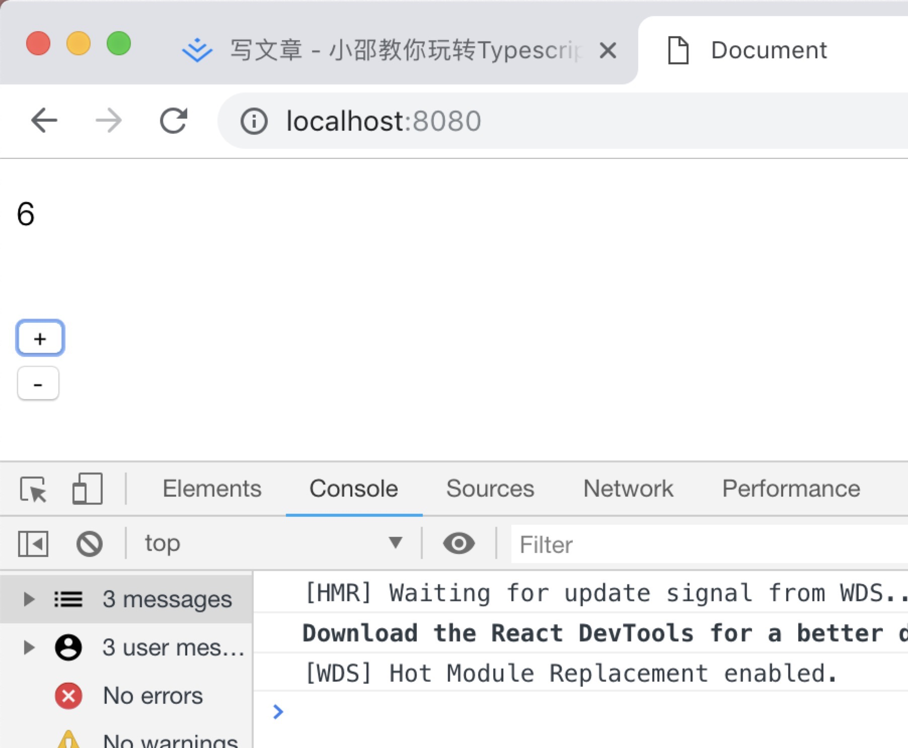

完美~ 能够正常执行

*---------------------Redux结束----------------------*

*---------------------合并reducers开始----------------------*

> 这部分代码已传到 https://github.com/iamswr/ts_react_demo_20181207/tree/reducers_combineReducers  
> 分支：reducers_combineReducers

假如我们的项目里面，有两个计数器，而且它俩是完全没有关系的，状态也是完全独立的，这个时候就需要用到合并reducers了。

下面这些步骤，其实有时间的话可以自己实现一次，因为在实现的过程中，你会发现，因为有了ts的类型校验，我们在修改的过程中，会给我们非常明确的报错，而不像以前，写一段，运行一下，再看看哪里报错，而ts是直接在编辑器中就提示报错了，让我们可以非常舒服地去根据报错和提示，去相应的地方修改。

首先我们把涉及到计数器组件的代码拷贝两份，因为改动太多了，可以在git上看，改动后的目录如图


首先我们新增`action`的动作行为类型，在`./src/store/action-types.tsx`

```
export const ADD = "ADD";
export const SUBTRACT = "SUBTRACT";
// 新增作为Counter2.tsx中的actions动作行为类型
export const ADD2 = "ADD2";
export const SUBTRACT2 = "SUBTRACT2";
```

然后修改接口文件，`./src/types/index.tsx`

```
// ./src/types/index.tsx
// 把Counter/Counter2组件汇总到一起
export interface Store {
  counter: Counter,
  counter2: Counter2
}
// 分别对应Counter组件
export interface Counter {
  number: number
}
// 分别对应Counter2组件
export interface Counter2 {
  number: number
}
```

然后把`./src/store/actions/counter.tsx`文件拷贝在当前目录并且修改名称为`counter2.tsx`

```
// ./src/store/actions/counter2.tsx
import * as types from "../action-types";
export interface Add{
  type:typeof types.ADD2
}
export interface Subtract{
  type:typeof types.SUBTRACT2
}

export type Action = Add | Subtract

export default {
  add():Add{
    return { type: types.ADD2}
  },
  subtract():Subtract{
    return { type: types.SUBTRACT2}
  },
  addAsync():any{
    return function (dispatch:any,getState:any) {
      setTimeout(function(){
        dispatch({type:types.ADD2})
      }, 1000);
    }
  }
}
```

然后把`./src/store/reduces/index.tsx`拷贝并且改名为`counter.tsx`和`counter2.tsx`

`counter.tsx`
```
import { Counter } from "../../types"
import { Action } from "../actions/counter"
import * as types from "../action-types"
let initState: Counter = { number:0 }
export default function (state: Counter=initState,action:Action) {
  switch (action.type) {
    case types.ADD:
        return { number:state.number + 1 }
      break;
    case types.SUBTRACT:
        return { number:state.number - 1 }
      break;
    default:
        return state
      break;
  }
}
```
`counter2.tsx`
```
import { Counter2 } from "../../types"
import { Action } from "../actions/counter2"
import * as types from "../action-types"
let initState:Counter2 = { number:0 }
export default function (state:Counter2=initState,action:Action) {
  switch (action.type) {
    case types.ADD2:
        return { number:state.number + 1 }
      break;
    case types.SUBTRACT2:
        return { number:state.number - 1 }
      break;
    default:
        return state
      break;
  }
}
```
`index.tsc`
#### 我们多个reducer是通过`combineReducers`方法，进行合并的，因为我们一个项目当中肯定是存在非常多个reducer，所以统一在这里处理。
```
// 引入合并方法
import { combineReducers } from "redux";
// 引入需要合并的reducer
import counter from "./counter";
// 引入需要合并的reducer
import counter2 from "./counter2";
// 合并
let reducers = combineReducers({
  counter,
  counter2,
});
export default reducers;
```

最后修改组件，进入`./src/components/`,其中
```
// ./src/components/Counter.tsx
import * as React from "react";
import { connect } from "react-redux";
import actions from "../store/actions/counter";
import { Store, Counter } from "../types";
interface IProps{
  number:number,
  add:any,
  subtract:any,
  addAsync:any
}
class CounterComponent extends React.Component<IProps>{
  render(){
    let { number, add, subtract, addAsync } = this.props
    return(
      <div>
        <p>{number}</p><br/>
        <button onClick={add}>+</button><br/>
        <button onClick={subtract}>-</button><br/>
        <button onClick={addAsync}>异步加1</button>
      </div>
    )
  }
}

let mapStateToProps = function (state: Store): Counter {
  return state.counter;
}
export default connect(
  mapStateToProps,
  actions
)(CounterComponent);
```
```
// ./src/components/Counter2.tsx
import * as React from "react";
// 引入connect，让组件和仓库建立连接
import { connect } from "react-redux";
// 引入actions，用于传给connect
import actions from "../store/actions/counter2";
// 引入接口约束
import { Store, Counter2 } from "../types";
// 接口约束
interface IProps{
  number:number,
  // add是一个函数
  add:any,
  // subtract是一个函数
  subtract:any,
  addAsync:any
}

class CounterComponent1 extends React.Component<IProps>{
  render(){
    // 利用解构赋值取出
    // 这里比如和IProps保持一致，不对应则会报错，因为接口约束了必须这样
    let { number, add, subtract, addAsync } = this.props
    return(
      <div>
        <p>{number}</p><br/>
        <button onClick={add}>+</button><br/>
        <button onClick={subtract}>-</button><br/>
        <button onClick={addAsync}>异步加1</button>
      </div>
    )
  }
}
// 这个connect需要执行两次，第二次需要我们把这个组件CounterComponent传进去
// connect第一次执行，需要两个参数，

// 需要传给connect的函数
let mapStateToProps = function (state: Store): Counter2 {
  return state.counter2;
}

export default connect(
  mapStateToProps,
  actions
)(CounterComponent1);
```

到目前为止，我们完成了reducers的合并了，那么我们看看效果如何，首先我们给`./src/index.tsc`添加`Counter2`组件，这样的目的是与`Counter`组件完全独立，互不影响，但是又能够最终合并到readucers

```
// ./src/index.tsx
import * as React from "react";
import * as ReactDom from "react-dom";
import { Provider } from "react-redux";
import store from './store'
import CounterComponent from "./components/Counter";
import CounterComponent2 from "./components/Counter2";
ReactDom.render((
  <Provider store={store}>
    <CounterComponent />
    <br/>
    <CounterComponent2 />
  </Provider>
),document.getElementById("app"))
```

然后到浏览器看看效果~  

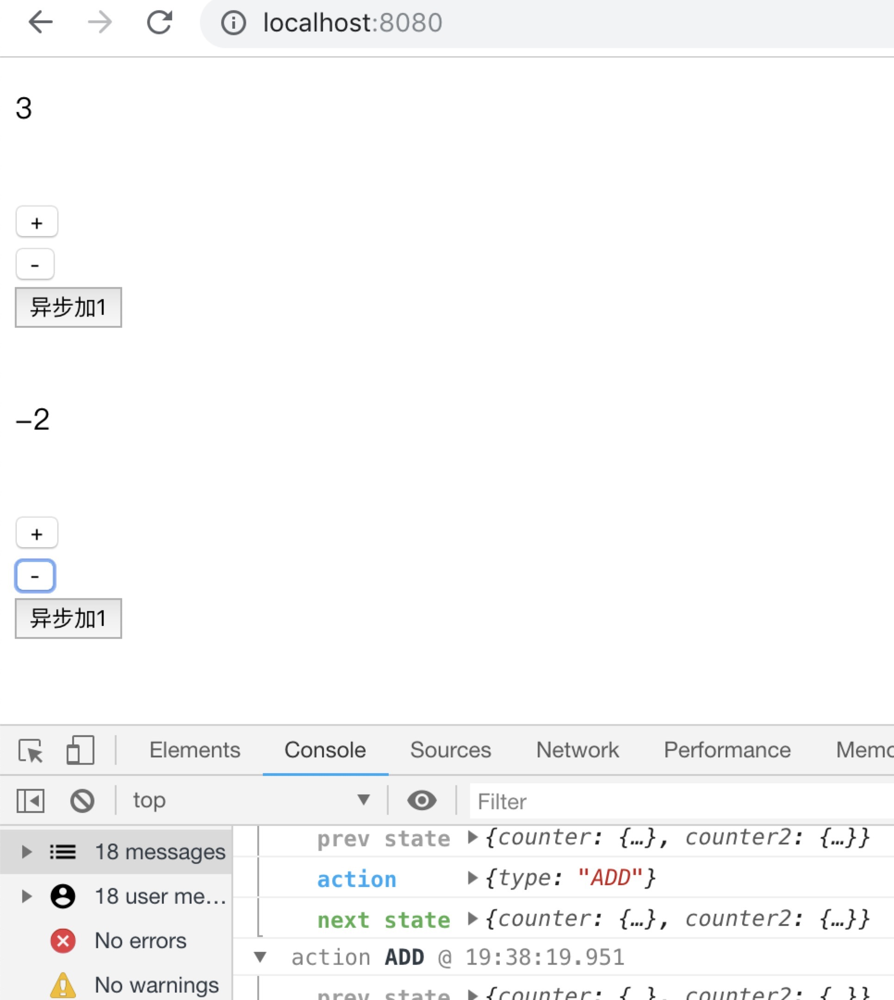

完美，这样我们就处理完reducers的合并了，在这个过程中，通过ts的类型检测，我不再像以前那样，写一段代码，运行看看是否报错，再定位错误，而是根据ts在编辑器的报错信息，直接定位，修改，把错误扼杀在摇篮。

*---------------------合并reducers结束----------------------*

*---------------------路由开始----------------------*

> 这部分代码已传到 https://github.com/iamswr/ts_react_demo_20181207/tree/HashRouter  
> 分支：HashRouter

首先进入`./src/index.tsx`导入我们的路由所需要的依赖包

```
// ./src/index.tsx
import * as React from "react";
import * as ReactDom from "react-dom";
import { Provider } from "react-redux";
import store from './store'
// 引入路由
// 路由的容器:HashRouter as Router
// 路由的规格:Route
// Link组件
import { HashRouter as Router,Route,Link } from "react-router-dom"
import CounterComponent from "./components/Counter";
import CounterComponent2 from "./components/Counter2";
import Counter from "./components/Counter";

function Home() {
  return <div>home</div>
}

ReactDom.render((
  <Provider store={store}>
    {/* 路由组件 */}
    <Router>
      {/*  放两个路由规则需要在外层套个React.Fragment */}
      <React.Fragment>
        {/* 增加导航 */}
        <ul>
          <li><Link to="/">Home</Link></li>
          <li><Link to="/counter">Counter</Link></li>
          <li><Link to="/counter2">Counter2</Link></li>
        </ul>
        {/* 当路径为 / 时是home组件 */}
        {/* 为了避免home组件一直渲染，我们可以添加属性exact */}
        <Route exact path="/" component={Home}/>
        <Route path="/counter" component={CounterComponent}/>
        <Route path="/counter2" component={CounterComponent2} />
      </React.Fragment>
    </Router>
  </Provider>
),document.getElementById("app"))
```

接下来看看路由是否配置成功

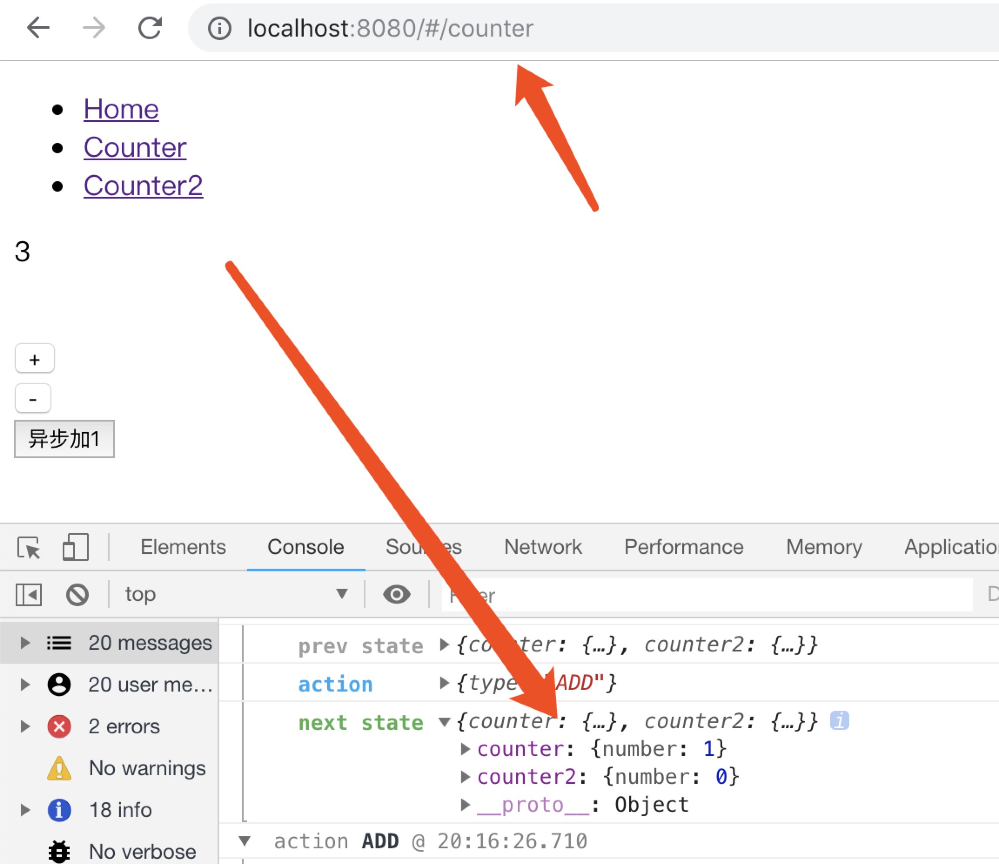

完美，成功了，也可以看出`Counter` `Counter2`组件是互相独立的。  

但是我们发现了一个问题，`http://localhost:8080/#/counter`中有个`#`的符号，非常不美观，那么我们如何变成`http://localhost:8080/counter`这样呢？ 

> 这部分代码已传到 https://github.com/iamswr/ts_react_demo_20181207/tree/connected-react-router  
> 分支：connected-react-router

我们还是进入`./src/index.tsx`，

把`import { HashRouter as Router,Route,Link } from "react-router-dom"`中的`HashRouter`更改为`BrowserRouter`

再从浏览器访问`http://localhost:8080/`再跳转到`http://localhost:8080/counter`发现还是很完美  

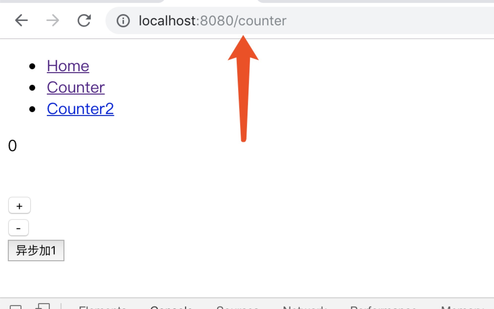

但是有个很大的问题，就是我们直接访问`http://localhost:8080/counter`会找不到路由


这是怎么回事？因为我们的是单页面应用，不管路由怎么变更，实际上都是访问`index.html`这个文件，所以当我们访问根路径的时候，能够正常访问，因为`index.html`文件就放在这个目录下，但是当我们通过非根路径的路由访问，则出错了，是因为我们在相应的路径没有这个文件，所以出错了。  

从这一点也可以衍生出一个实战经验，我们平时项目部署上线的时候，会出现这个问题，一般我们都是用`ngxin`来把访问的路径都是指向`index.html`文件，这样就能够正常访问了。

那么针对目前我们这个情况，我们可以通过修改`webpack`配置，让路由不管怎么访问，都是指向我们制定的`index.html`文件。

进入`./webpack.config.js`，在`devServer`的配置对象下新增一些配置

```
// ./webpack.config.js
...

  // 开发环境服务配置
  devServer:{
    // 启动热更新,当模块、组件有变化，不会刷新整个页面，而是局部刷新
    // 需要和插件webpack.HotModuleReplacementPlugin配合使用
    hot:true, 
    // 静态资源目录
    contentBase:path.resolve(__dirname,'dist'),
    // 不管访问什么路径，都重定向到index.html
    historyApiFallback:{
      index:"./index.html"
    }
  }

...
```

修改`webpack`配置需要重启服务，然后重启服务，看看浏览器能否正常访问`http://localhost:8080/counter`


完美，不管访问什么路径，都能够正常重定向到`index.html`了

接下来，完美这个路由的路径，如何同步到仓库当中呢？  

以前是用一个叫`react-router-redux`的库，把路由和`redux`结合到一起的，`react-router-redux`挺好用的，但是这个库不再维护了，被废弃了，所以现在推荐使用`connected-react-router`这个库，可以把路由状态映射到仓库当中。

首先我们在`./src`下创建文件`history.tsx`，

```
// ./src/history.tsx
// 引入一个基于html5 api的history的createBrowserHistory
import { createBrowserHistory } from "history";
// 创建一个history
let history = createBrowserHistory();
// 导出
export default history;
```

假设我有一个需求，就是我不通过`Link`跳转页面，而是通过编程式导航，触发一个动作，然后这个动作会派发出去，而且把路由信息放到redux中，供我以后查看。

我们进入`./src/store/reducers/index.tsx`

```
// ./src/store/reducers/index.tsx
import { combineReducers } from "redux";
import counter from "./counter";
import counter2 from "./counter2";
// 引入connectRouter
import { connectRouter } from "connected-react-router";
import history from "../../history";

let reducers = combineReducers({
  counter,
  counter2,
  // 把history传到connectRouter函数中
  router: connectRouter(history)
});
export default reducers;
```

我们进入`./src/store/index.tsx`来添加中间件

```
// ./src/store/index.tsx

```

我们进入`./src/store/actions/counter.tsx`加个`goto`方法用来跳转。

```
// ./src/store/actions/counter.tsx

```

我们进入`./src/components/Counter.tsx`中加个按钮，当我点击按钮的时候，会向仓库派发action，仓库的action里有中间件，会把我们这个请求拦截到，然后跳转。

```
// ./src/components/Counter.tsx
import * as React from "react";
import { connect } from "react-redux";
import actions from "../store/actions/counter";
import { Store, Counter } from "../types";
interface IProps{
  number:number,
  add:any,
  subtract:any,
  addAsync:any,
  goto:any
}
class CounterComponent extends React.Component<IProps>{
  render(){
    let { number, add, subtract, addAsync,goto } = this.props
    return(
      <div>
        <p>{number}</p><br/>
        <button onClick={add}>+</button><br/>
        <button onClick={subtract}>-</button><br/>
        <button onClick={addAsync}>异步加1</button>
        {/* 增加一个按钮,并且点击的时候执行goto方法实现跳转 */}
        <button onClick={()=>goto('/counter2')}>跳转到/counter2</button>
      </div>
    )
  }
}

let mapStateToProps = function (state: Store): Counter {
  return state.counter;
}
export default connect(
  mapStateToProps,
  actions
)(CounterComponent);
```

*---------------------路由结束----------------------*

到此为止，用typesript把react全家桶简单过了一遍，之所以写typesript版react全家桶，是为了让大家知道这个typesript在实际项目中，是怎么使用的，但是涉及到各个文件跳来跳去，有时候很简单的几句话可以带过，但是为了大家明白，写得也啰里啰嗦的，刚开始使用typesript，感觉效率也没怎么提高，但是在慢慢使用当中，会发现，确实很多错误，能够提前帮我们发现，这对以后项目的维护、重构显得非常重要，否则将来项目大了，哪里出现错误了，估计也需要排查非常久的时间，typesript将来或许会成为趋势，作为前端，总要不断学习的嘛